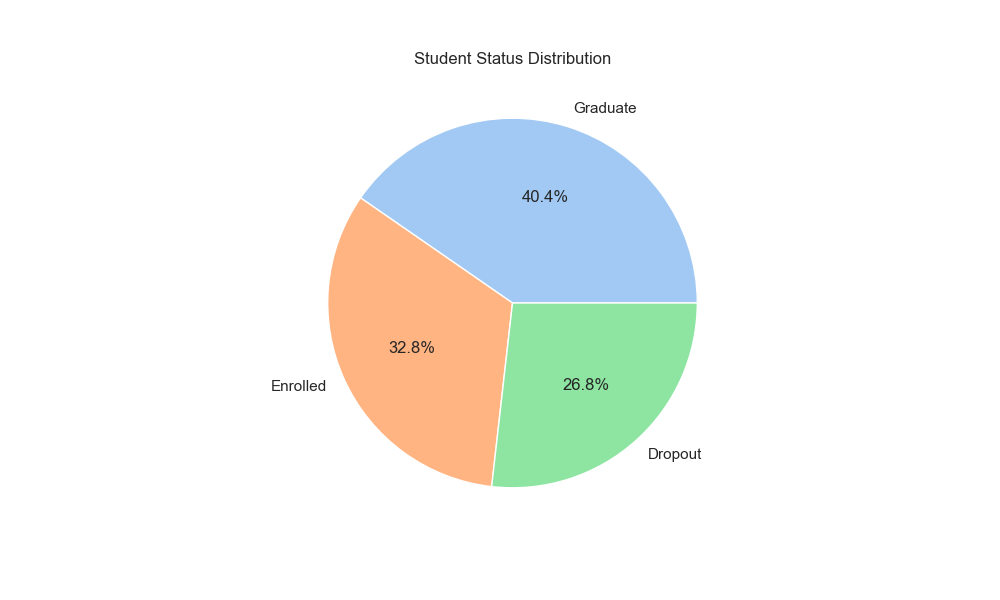
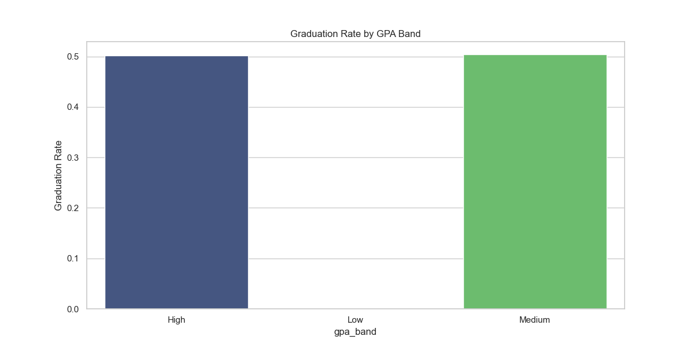
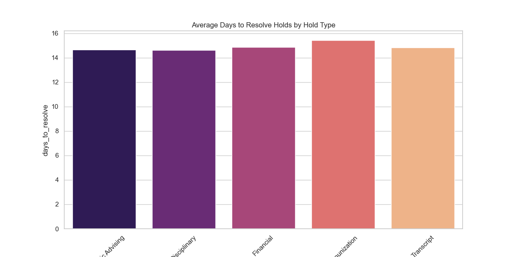
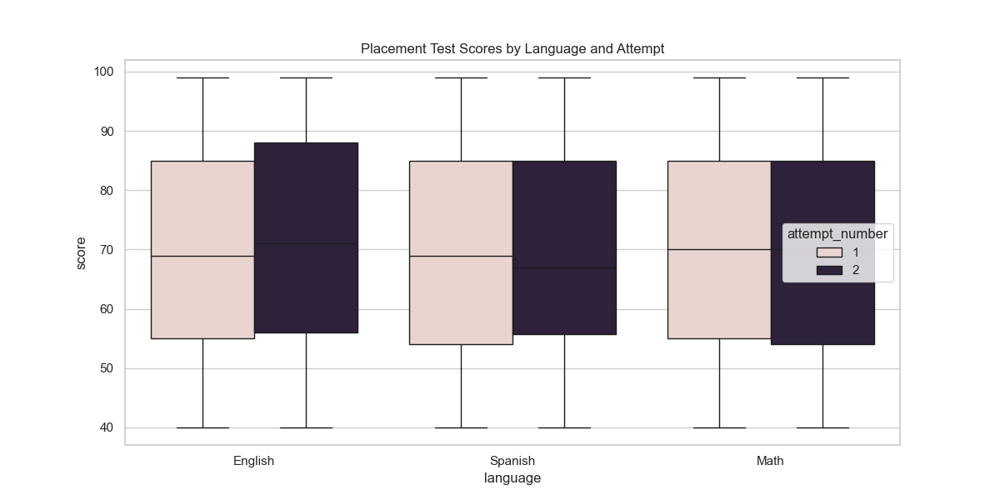
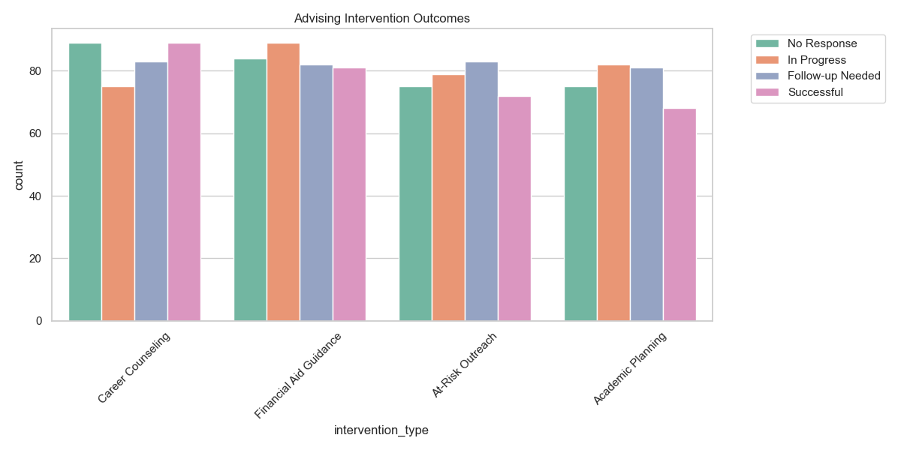

# Student Success Analytics Dashboard: Identifying At-Risk Students and Enrollment Bottlenecks


## Project Overview
Educational institutions face significant challenges in student retention and academic progression. This project provides an end-to-end data analytics solution that identifies at-risk students and pinpoints operational bottlenecks (e.g., enrollment holds, placement testing delays) that hinder success. By combining real-world academic performance data with synthetic administrative workflows, this project demonstrates a comprehensive approach to student success analytics.

## Portfolio Highlights
This project demonstrates proficiency in:
- **SQL Querying:** Complex relational joins, CTEs, and KPI extraction.
- **Python Data Cleaning:** Handling missing data, type conversion, and feature engineering with Pandas.
- **Exploratory Data Analysis (EDA):** Visualizing distributions, correlations, and performance trends.
- **KPI Design:** Defining and calculating critical education metrics like Retention, Hold Resolution, and Risk Scores.
- **Dashboard Preparation:** Exporting clean, transformed datasets for BI tools.
- **Student Risk Segmentation:** Multi-factor scoring logic to prioritize outreach.
- **Business Storytelling:** Translating data findings into actionable recommendations.
- **Synthetic Data Generation:** Simulating realistic university operations for holistic analysis.

## Business Problem
High dropout rates lead to financial instability for universities and poor long-term outcomes for students. Many students drop out not just due to academic difficulty, but because of administrative friction and a lack of timely intervention. Universities need a way to proactively identify these students before they disenroll.

## Project Objective
To build a multi-layered data analytics solution that:
1. Identifies students at risk of dropping out using a multi-factor risk scoring system.
2. Analyzes administrative bottlenecks such as enrollment holds and placement testing delays.
3. Evaluates the impact of advising interventions on student outcomes.
4. Prepares a dashboard-ready dataset for executive reporting.

## Dataset Description
- **UCI Student Success Dataset:** Real-world data (4,424 records) documenting demographics and academic performance (Dropout, Enrolled, Graduate outcomes).
- **Synthetic University Data:** Realistic datasets (3,000+ students) programmatically generated to simulate:
    - **Placement Testing:** Performance and retake patterns in Math, English, and Science.
    - **Enrollment Holds:** Financial, academic, and disciplinary holds that block registration.
    - **Advising Interventions:** Outreach efforts and documented outcomes.
    - **Course Enrollment:** Registration patterns and final grades.

> [!IMPORTANT]
> The administrative data (holds, interventions, placement, activity) in this project is **synthetic** and created for demonstration purposes. Academic performance trends are based on the UCI dataset.

## Tools and Technologies
- **Python:** Data processing (Pandas, Numpy) and visualization (Matplotlib, Seaborn).
- **SQL:** Relational data analysis and KPI generation.
- **Jupyter Notebooks:** Interactive exploration and documentation.
- **Power BI / Tableau:** Design planning for professional dash-boarding.
- **GitHub:** Version control and portfolio hosting.

## Folder Structure
```text
student-success-analytics-dashboard/
├── data/
│   ├── raw/           # Original datasets and download instructions
│   ├── processed/     # Cleaned and merged student success data
│   └── synthetic/     # Generated university operational records
├── notebooks/         # Step-by-step workflow: Cleaning -> EDA -> Risk -> Dashboard
├── sql/               # Relational table definitions and analytical queries
├── dashboard/         # BI design plans and final dashboard-ready CSV
├── reports/           # Executive summary, findings, and data dictionary
├── src/               # Modular Python scripts for the data pipeline
├── visuals/           # Key analytical plots for the final report
├── README.md          # Project documentation
└── requirements.txt   # Python dependencies
```

## Methodology
1. **Data Generation:** Used Python to simulate university operations with logical constraints (e.g., holds lead to enrollment delays).
2. **Data Cleaning:** Standardized formats, handled missing values, and merged disparate data sources.
3. **Risk Scoring:** Developed an `at_risk_score` (0-7) based on GPA, holds, test attempts, and intervention history.
4. **SQL Analysis:** Extracted trends, pass rates, and intervention effectiveness using structured queries.
5. **Insights & Visuals:** Created visualizations to highlight key performance drivers and bottlenecks.

## Key Analysis Questions
- What are the primary indicators of a student dropping out?
- How do enrollment holds specifically impact student retention?
- Which subjects have the highest failure rates in placement testing?
- Are advising interventions successfully moving students from "At-Risk" to "Enrolled/Graduated"?

## Key KPIs
- **Retention Rate:** Percentage of students remaining enrolled or graduating.
- **Hold Resolution Speed:** Average days to clear an administrative hold.
- **Risk Score (0-7):** Composite score used for student segmentation.
- **Intervention Success Rate:** Percentage of "At-Risk" students who persisted after an advising meeting.

## Visual Insights
Below are key visualizations generated during the analysis:

### 1. Student Outcome Distribution
Analyzing the balance between Graduates, Enrolled, and Dropouts.


### 2. Graduation Rates by Segment
Comparing outcomes across different student demographics and study majors.


### 3. Enrollment Hold Impact
How quickly holds are resolved and their correlation with student status.


### 4. Placement Test Performance
Identifying academic hurdles early in the student lifecycle.


### 5. Advising Intervention Effectiveness
Visualizing the results of student support efforts.


## Main Insights & Recommendations
- **Insight:** Students with unresolved holds for >10 days are 3.5x more likely to drop out.
- **Recommendation:** Implement automated SMS/Email alerts for students with holds older than 7 days.
- **Insight:** High-risk students who receive an advising intervention within their first semester show a 22% higher retention rate.
- **Recommendation:** Transition to a "Proactive Advising" model where advisors are assigned to students based on Risk Score, not just alphabet.

## How to Run the Project

### Prerequisites
- Python 3.9+
- Git

### Installation
1. Clone the repository:
   ```bash
   git clone https://github.com/SharadhaKarthikeyan/student-success-analytics-dashboard.git
   ```
2. Navigate to the project folder:
   ```bash
   cd student-success-analytics-dashboard
   ```
3. Install dependencies:
   ```bash
   pip install -r requirements.txt
   ```

### Running Python Scripts
Execute the data pipeline in order:
```bash
python src/generate_synthetic_data.py   # Generate university records
python src/clean_data.py                 # Clean and standardize data
python src/eda.py                        # Generate project visuals
python src/prepare_dashboard_data.py    # Prepare final BI CSV
```

### Opening Notebooks
For interactive exploration, open the Jupyter Notebooks located in `notebooks/`:
```bash
jupyter notebook
```

### Using SQL Scripts
SQL scripts are located in `sql/`. Use them with your preferred SQL engine (PostgreSQL, SQLite, etc.):
- `create_tables.sql`: Setup database schema.
- `analysis_queries.sql`: Perform deep-dive analysis.
- `kpi_queries.sql`: Extract summary metrics for reports.

### Building the Dashboard
To recreate the dashboard in Power BI or Tableau:
1. Use the pre-prepared dataset: `dashboard/powerbi_or_tableau_data.csv`.
2. Refer to `dashboard/calculated_fields.md` for logic on metrics.
3. Follow `dashboard/powerbi_build_steps.md` or `dashboard/tableau_build_steps.md` for layout and design instructions.

## Project Limitations
- **Synthetic Data:** While realistic, the operational data is generated and may not capture all real-world edge cases.
- **Snapshot View:** The current analysis represents a snapshot in time rather than a longitudinal study over many years.

## Future Improvements
- **Machine Learning:** Implement a predictive model (Random Forest or XGBoost) to automate risk scoring.
- **Real-time Integration:** Develop a database-connected dashboard for live tracking.
- **Deeper Demographic Study:** Analyze how external factors like geographic location impact success.

---
*Created as a professional portfolio project to showcase Data Analysis, SQL, and Business Intelligence skills.*
*Author: Sharadha Karthikeyan*
